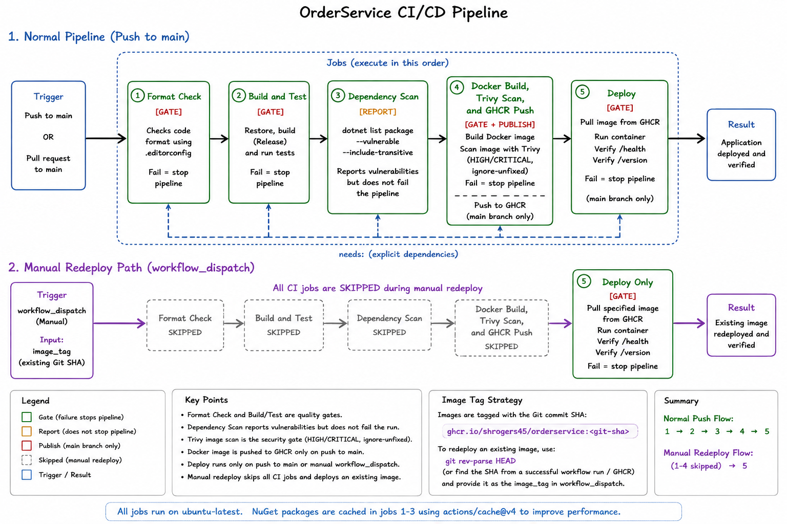

# OrderService CI/CD Pipeline

The diagram below shows the GitHub Actions pipeline, including:

- workflow triggers
- job dependencies using `needs:`
- blocking quality/security gates
- report-only dependency scanning
- main-branch-only publishing and deployment
- manual `workflow_dispatch` redeployment of an existing GHCR image

